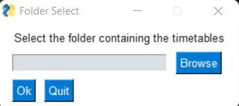
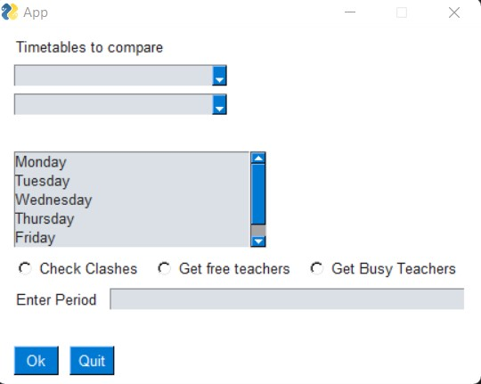

# SchoolProject-2.0
An updated version of the timetable manager that can be found in https://github.com/LordA2117/School-Project/.

# Instructions
1. Download the project either by downloading and extracting the zip folder or clone the project.
2. Execute the shortcut that is seen titled 'app'.
3. The timetables required for testing are included in the project in the folder 'SchoolData'.
4. From the window that opens when running the .exe file, click on browse and select the folder containing the timetables(SchoolData in this case.).
5. Choose the timetables in the dropdown lists in the new window that appears after choosing the folder.
6. Choose a day to check the clashes in the timetable and choose a period so as to find all the free teachers in that period. The functions are listed in radio buttons, that is 'Check Clashes' to get the clashes in the timetable, 'View Free Teachers' to get all teachers of a specific period, and 'View Busy Teachers' to get all the busy teachers of a specific period.

# Scope
The main purpose of this project is to obtain the clashes in the timetables of 2 teachers. The aforementioned clashes can only be obtained between 2 different timetables. However, the functions to view free and busy teachers can be used accross all timetables in a particular folder. It is important to note that the project is not meant to be a full scale application and is only limited to the purposes assigned to me, that is to check clashes between 2 timetables. All extra features that are described above are side effects of the main purpose, which is to check clashes between 2 timetables.

# Assumptions
Each teacher's timetable is housed in a separate excel file and the timetable is written in the format as seen in the project. It can detect clashes in any number of periods but the timetable must be written in the format as seen in the project. 

# Code
1. The project is written fully in python 3(python 3.10.2). 
2. The excel file parser(the module that reads the excel file) utilises the openpyxl(version 3.0.10) library, and the Graphical User Interface uses a module called PySimpleGUI, which is a wrapper for the Tkinter module built-in to python. 
3. Additionally, the project was made in a python virtual environment, meaning that to use the project, there is no need to install python, or have the latest version of python(unless the user intends to modify the project in some way).
4. GUI(source code): https://github.com/LordA2117/SchoolProject-2.0/blob/main/app.py
5. Excel File Parser(source code): https://github.com/LordA2117/SchoolProject-2.0/blob/main/Fscan.py

# Project Screenshots
## Folder Browser: 

## Main Window:

